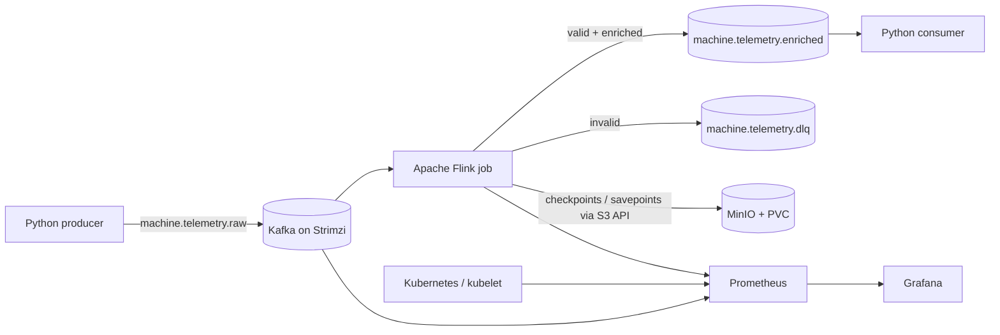
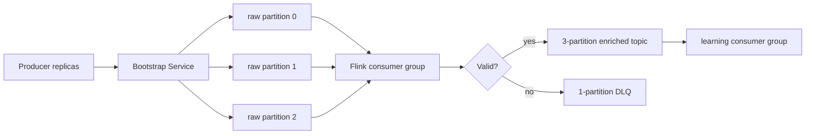
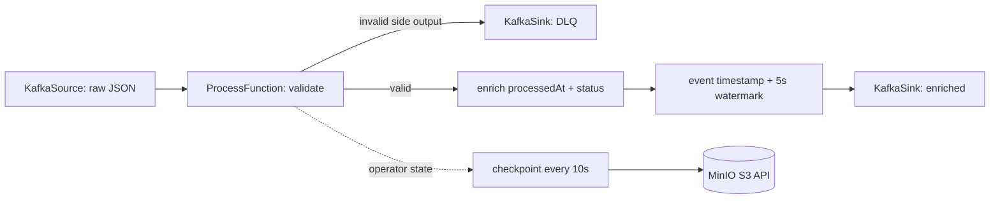
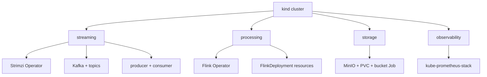
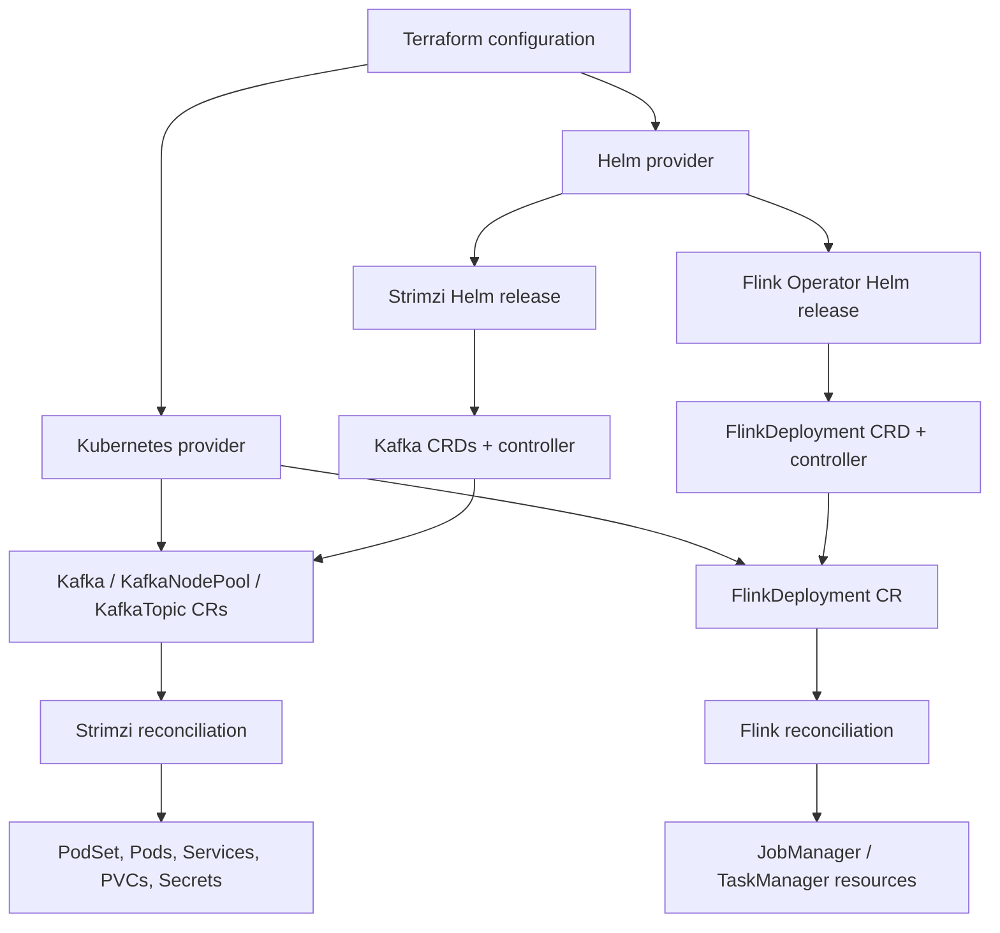

# Architecture

## 1. Complete platform

All arrows stay inside the kind network except browser access through `kubectl port-forward`. Kubernetes Service DNS provides addresses such as `local-kafka-kafka-bootstrap.streaming.svc.cluster.local` and `minio.storage.svc.cluster.local`.

## 2. Kafka data flow

A key is intentionally not set, so Kafka distributes records among partitions. Ordering is guaranteed only within one partition. Flink parallelism 2 can consume two partitions concurrently; one subtask can receive the remaining partition. Consumer-group offsets identify the next records each group should read.

## 3. Flink job

The current transform is stateless, but checkpoints still persist Kafka source offsets and sink progress. This makes failure/replay behavior observable now and leaves the correct foundation for later keyed state or windows.

The JobManager coordinates the job graph and checkpoints. TaskManagers execute parallel subtasks in slots. Two TaskManager slots and job parallelism 2 allow two copies of each parallel operator. Backpressure propagates upstream when a downstream operator cannot accept records fast enough.

## 4. Kubernetes namespaces

Namespaces isolate names and provide an RBAC boundary; they do not provide network isolation by themselves. The application ServiceAccount has no Kubernetes API token. Operator ServiceAccounts receive the API permissions their Helm charts require.

## 5. Terraform, Helm, and operators

Terraform does not create Kafka broker Pods directly. It creates the Kafka custom resource. Strimzi observes that resource and creates/repairs the implementation. The same relationship applies to `FlinkDeployment`.

This also explains the two-phase bootstrap: `kubernetes_manifest` asks the Kubernetes API for a custom resource's schema during `terraform plan`. Therefore the Helm releases must install CRDs first; an HCL `depends_on` controls apply order but cannot make a missing schema exist during planning.

## Storage and failure boundaries

- Kafka and MinIO use kind's dynamic `standard` StorageClass. A PVC binds to a host-path volume inside a kind node.
- Deleting a Pod retains its PVC. Deleting the kind cluster deletes the Docker nodes and their local volume data.
- Flink checkpoints/savepoints use the MinIO Service, not the TaskManager filesystem, so a TaskManager replacement can restore from shared object storage.
- `deleteClaim: true` makes Kafka storage disposable when the Kafka cluster is destroyed. This is appropriate only for the lab.

## Resource envelope

| Area | Approximate steady RAM |
|---|---:|
| kind/Kubernetes system | 0.5–1.0 GB |
| Strimzi + Kafka + exporter | 1.2–1.8 GB |
| Flink operator + job | 1.5–2.2 GB |
| MinIO | 0.3–0.5 GB |
| Prometheus + Grafana + operators | 1.0–1.6 GB |
| Apps and headroom | 0.3–0.8 GB |
| **Total** | **about 5–7 GB** |

If memory is tight, install through Flink first and add observability last. Do not shrink Kafka or Flink JVM memory below the configured values until the base path works.
